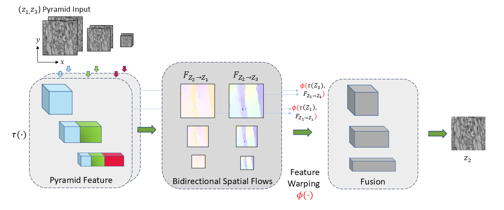

# Z-upscaling
This repository contains the source code for our paper:

[Z-upscaling: Optical Flow Guided Frame Interpolation for Isotropic Reconstruction of 3D EM Volumes](https://arxiv.org/pdf/2410.07043)<br/>
Fisseha A. Ferede, Ali Khalighifar, Jaison John, Krishnan Venkataraman, Khaled Khairy<br/>



## Demo

<div style="display: flex; justify-content: center; gap: 20px;">
   <div style="text-align: center; width: 220px;">
      
      <div style="margin-top: 8px;">Input Downsampled Volume</div>
   </div>

   <div style="text-align: center; width: 220px;">
      
      <div style="margin-top: 8px;">Upscaled Volume (Z × 8)</div>
   </div>

   <div style="text-align: center; width: 220px;">
      
      <div style="margin-top: 8px;">Ground Truth Volume</div>
   </div>
</div>


## Evaluation

Download pretrained models [Saved models](https://drive.google.com/drive/folders/1vFvyuP4FdU8A0_Y0iA7CHSvlAFPH6StX?usp=sharing)
```Shell
python3 /Z-upscaling-main/eval/interpolator_cli.py \
   --pattern "/Z-upscaling-main/Demo/*" \
   --model_path /Z-upscaling-main/ModelPaths/test_run_ft_em_/saved_model_2M \
   --outputfile /Z-upscaling-main/Demo_out \
   --times_to_interpolate 8 \
   --output_volume "True" \
   --remove_sliced_volumes "False"

```